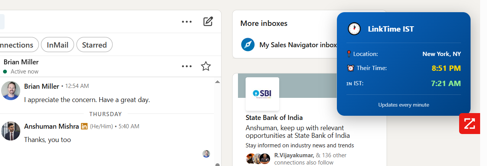

# 🕐 LinkTime IST

**Convert LinkedIn contacts' local time to IST instantly**

A lightweight Chrome extension that detects your LinkedIn chat contacts' locations and displays their current local time converted to **Indian Standard Time (IST)** — directly inside the LinkedIn messaging interface.

---
<!-- How does it came in my mind:
Read this: https://claude.ai/public/artifacts/d5e4844c-a566-4eeb-917f-0693ef518aa7 -->
---

## 📌 Overview

LinkTime IST helps professionals working across global time zones avoid scheduling confusion. It automatically reads the contact’s local time from LinkedIn chat, converts it into IST, and displays it inline in a clean, native-looking format.

---
## Screenshot



### Before

**Shylaja Kadamby**
Driving 7-Figure Savings in Supply Chain | WMS/OMS Authority

### After

**Shylaja Kadamby**
Driving 7-Figure Savings in Supply Chain | WMS/OMS Authority
`active 35m ago (12:21am in London) • IST: 5:51am`

---

## ✨ Features

* 🌍 **Auto-detection** – Automatically detects contact’s location from LinkedIn chat
* ⏰ **Real-time Conversion** – Accurately converts local time to IST
* 🎨 **Clean UI** – Seamlessly blends with LinkedIn’s native design
* 🚀 **Lightweight** – Minimal performance and memory impact
* 🔄 **Auto-update** – Refreshes time every 60 seconds
* 🌐 **100+ Cities** – Supports major cities worldwide

---

## 🚀 Installation

### Option 1: Chrome Web Store (Coming Soon)

Will be available once published.

### Option 2: Manual Installation (Developer Mode)

#### 1. Download the Extension

```bash
git clone https://github.com/yourusername/linktime-ist.git
cd linktime-ist
```

#### 2. Download Dependencies

Download the **Luxon** library from the official CDN:
Save it as `luxon.min.js` in the root of the extension folder.

#### 3. Load in Chrome

1. Open Chrome and go to:

   ```
   chrome://extensions/
   ```
2. Enable **Developer mode** (toggle in the top-right)
3. Click **Load unpacked**
4. Select the `linktime-ist` folder

#### 4. Start Using

* Go to **LinkedIn Messaging**
* Open any chat
* The IST time will appear automatically

---

## 📁 Project Structure

```
linktime-ist/
├── manifest.json          # Extension configuration
├── content.js            # Core logic and timezone conversion
├── styles.css            # UI styling
├── luxon.min.js         # Timezone library (download separately)
├── icons/
│   ├── icon16.png       # 16x16 icon
│   ├── icon48.png      # 48x48 icon
│   └── icon128.png    # 128x128 icon
├── README.md            # This file
└── LICENSE              # MIT License
```

---

## 🛠️ How It Works

1. **Detection**
   Scans LinkedIn chat messages for time and location patterns such as:

   ```
   (12:21am in London)
   ```

2. **Timezone Mapping**
   Matches the detected city with a timezone database (100+ supported cities).

3. **Conversion**
   Uses **Luxon** to convert the detected local time into IST.

4. **Injection**
   Displays the converted time inline with LinkedIn’s UI.

5. **Updates**
   Refreshes the displayed time every 60 seconds automatically.

---

## 🌍 Supported Locations

### North America

New York, Los Angeles, Chicago, San Francisco, Toronto, Vancouver, and more

### Europe

London, Paris, Berlin, Amsterdam, Madrid, Rome, Dublin, and more

### Asia

Singapore, Tokyo, Hong Kong, Dubai, Bangkok, Seoul, and more

### Australia & Others

Sydney, Melbourne, Auckland, São Paulo, Buenos Aires, and more

**Total:** 100+ cities across all major timezones

---

## 🔧 Development

### Prerequisites

* Chrome Browser
* Basic knowledge of JavaScript
* Node.js (optional, for build tools)

### Local Development Setup

#### 1. Clone the Repository

```bash
git clone https://github.com/yourusername/linktime-ist.git
cd linktime-ist
```

#### 2. Make Your Changes

* `content.js` → Core logic
* `styles.css` → UI styling
* `manifest.json` → Extension configuration

#### 3. Test Locally

* Load the extension in Chrome (Developer Mode)
* Open LinkedIn Messaging
* Test in multiple chats
* Check the browser console for logs

### Debug Mode

1. Open Console:

   ```
   F12
   ```
2. Look for messages starting with:

```
🕐 LinkTime IST: Extension loaded successfully
✅ FOUND: "12:21am in London"
✅ IST time injected successfully!
```

---

## ➕ Adding New Timezones

Edit the `TIMEZONE_MAP` in `content.js`:

```javascript
const TIMEZONE_MAP = {
  'berlin': 'Europe/Berlin',
  'your city': 'Timezone/Identifier'
  // Add more cities...
};
```

---

## 🐛 Troubleshooting

### Extension Not Showing Time

* Open Console (F12)
* You should see:

```
🕐 LinkTime IST: Extension loaded successfully
```

### Common Issues

#### Missing `luxon.min.js`

* Download it from the CDN
* Place it in the root folder of the extension

#### Wrong LinkedIn Page

* Extension only works on:

  ```
  /messaging/*
  ```

#### Location Not Recognized

* Check if the city exists in `TIMEZONE_MAP`
* Add it manually if missing

#### CSP Errors

* Verify `manifest.json`
* Check `web_accessible_resources` configuration

---

## 📊 Performance

* **Bundle Size:** ~85KB (including Luxon)
* **Memory Usage:** <5MB
* **CPU Impact:** Negligible (<0.1%)
* **Load Time:** <100ms

---

## 🤝 Contributing

Contributions are welcome.

### Steps

1. Fork the repository
2. Create a feature branch

   ```bash
   git checkout -b feature/amazing-feature
   ```
3. Commit your changes

   ```bash
   git commit -m "Add amazing feature"
   ```
4. Push to the branch

   ```bash
   git push origin feature/amazing-feature
   ```
5. Open a Pull Request

### Guidelines

* Follow the existing code style
* Add comments for complex logic
* Test thoroughly on LinkedIn
* Update documentation if needed

---

## 📝 Roadmap

### Version 1.x (Current)

* Basic time conversion
* Inline display
* 100+ city support
* Chrome Web Store listing

### Version 2.x (Planned)

* Firefox support
* Custom timezone preferences
* Timezone offset display
* Historical timezone data
* Click-to-copy functionality

### Version 3.x (Future)

* Meeting scheduler integration
* Multiple timezone display
* Team timezone overview
* Calendar integration
* Mobile app

---

## 📜 License

This project is licensed under the **MIT License**.

```
MIT License

Copyright (c) 2025 LinkTime IST

Permission is hereby granted, free of charge, to any person obtaining a copy
of this software and associated documentation files (the "Software"), to deal
in the Software without restriction, including without limitation the rights
to use, copy, modify, merge, publish, distribute, sublicense, and/or sell
copies of the Software, and to permit persons to whom the Software is
furnished to do so, subject to the following conditions:

The above copyright notice and this permission notice shall be included in all
copies or substantial portions of the Software.

THE SOFTWARE IS PROVIDED "AS IS", WITHOUT WARRANTY OF ANY KIND, EXPRESS OR
IMPLIED, INCLUDING BUT NOT LIMITED TO THE WARRANTIES OF MERCHANTABILITY,
FITNESS FOR A PARTICULAR PURPOSE AND NONINFRINGEMENT.
```

---

## 🙏 Acknowledgments

* **Luxon** – Modern timezone library
* **LinkedIn** – Platform integration
* **Contributors** – Thank you for improving this project

---

